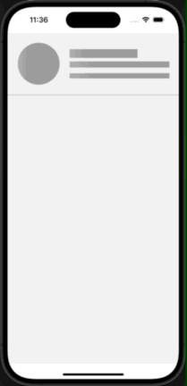
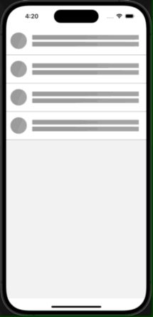

# react-native-dynamic-shimmer

[](https://www.npmjs.com/package/react-native-dynamic-shimmer) [](https://www.npmtrends.com/react-native-dynamic-shimmer) [](https://packagephobia.com/result?p=react-native-dynamic-shimmer) [](https://www.android.com) [](https://developer.apple.com/ios) [](https://opensource.org/licenses/MIT)

---

This package offers an efficient Shimmer component wrapper for React Native apps, enabling you to effortlessly show loading placeholders (shimmer effects) while data is being retrieved.

The Shimmer component can be used with any view, including text, images, and custom components, ensuring a smooth loading experience.

---

## 🎬 Preview

---

 <table>
    <tr>
      <td><a href="https://github.com/SimformSolutionsPvtLtd/react-native-dynamic-shimmer"></a></td>
      <td><a href="https://github.com/SimformSolutionsPvtLtd/react-native-dynamic-shimmer"></a></td>
    </tr>
  </table>

---

## Quick Access

- [Installation](#installation)
- [Usage and Examples](#usage)
- [Properties](#properties)
- [Example Code](#example)
- [License](#license)

## Getting Started 🔧

Here's how to get started with react-native-dynamic-shimmer in your React Native project:

### Installation

##### 1. Install the package

```bash
$ npm install react-native-dynamic-shimmer
# --- or ---
$ yarn add react-native-dynamic-shimmer
```

##### 2. Install peer dependencies

```bash
$ npm install lodash
# --- or ---
$ yarn add lodash
```

##### 3. Install cocoapods in the ios project

```bash
cd ios && pod install
```

##### Know more about [lodash](https://www.npmjs.com/package/lodash)

---

### Usage

#### Basic Example

Here we’ve created a simple component and wrapped that in Shimmer to show shimmer effect.

```tsx
import React, { useEffect, useState } from 'react';
import { Image, Text, View, StyleSheet } from 'react-native';
import { Shimmer } from 'react-native-dynamic-shimmer';
import LinearGradient from 'react-native-linear-gradient';

const App = (): React.JSX.Element => {
  const [isLoading, setIsLoading] = useState(true);

  useEffect(() => {
    const timer = setTimeout(() => {
      setIsLoading(false);
    }, 3000);

    return () => clearTimeout(timer);
  }, []);

  const ShimmerElement = () => {
    return (
      <LinearGradient
        start={{ x: 0.0, y: 0.25 }}
        end={{ x: 1.0, y: 0.25 }}
        locations={[0, 0.5, 1]}
        colors={[Colors.gray, Colors.white, Colors.gray]}
        style={StyleSheet.absoluteFillObject}
      />
    );
  };

  const ProfileCard = (): React.JSX.Element => {
    return (
      <View style={styles.profileContainer}>
        <Image
          style={styles.profileImage}
          source={{
            uri: 'https://randomuser.me/api/portraits/men/1.jpg',
          }}
        />
        <View style={styles.textWrapper}>
          <Text aria-label="Michael Williams" style={styles.name}>
            Michael Williams
          </Text>
          <Text style={styles.jobTitle}>Software Engineer</Text>
          <Text style={styles.profileBio}>
            Lorem ipsum dolor sit amet, consectetur adipiscing elit. Nulla
            ultricies urna eget sapien ultrices, eu maximus justo rutrum.
          </Text>
        </View>
      </View>
    );
  };

  return (
    <Shimmer loading={isLoading} duration={2450} shimmerElement={<ShimmerElement />}>
      <ProfileCard />
    </Shimmer>
  );
};

const styles = StyleSheet.create({
  profileContainer: {
    flexDirection: 'row',
    alignItems: 'center',
    padding: 20,
    borderBottomWidth: 1,
    borderBottomColor: '#9b9b9b',
  },
  profileImage: {
    width: 100,
    height: 100,
    borderRadius: 50,
    marginRight: 20,
  },
  textWrapper: {
    flex: 1,
  },
  name: {
    fontSize: 24,
    fontWeight: 'bold',
    marginBottom: 5,
  },
  jobTitle: {
    fontSize: 18,
    marginBottom: 10,
    color: '#9b9b9b',
  },
  profileBio: {
    fontSize: 16,
    lineHeight: 22,
  },
});

export default App;
```

> **Note: If you're using React Native CLI, you can use LinearGradient from the 'react-native-linear-gradient' package for the shimmer element, as shown in the above example. For Expo projects, you should use 'expo-linear-gradient' instead of 'react-native-linear-gradient' for gradient support for shimmer element**.

#### 🎬 Preview

---

  <table>
    <tr>
      <td><a href="https://github.com/SimformSolutionsPvtLtd/react-native-dynamic-shimmer"></a></td>
    </tr>
  </table>

### Properties

| **Props**    | **Default** |      **Type**      | **Description**                                                                                                                                                                                                                   |
| ------------ | :---------: | :----------------: | --------------------------------------------------------------------------------------------------------------------------------------------------------------------------------------------------------------------------------- |
| **children** |      -      |  React.ReactNode   | The child components that will be rendered inside the Shimmer component. When loading is true, these children will be replaced by the shimmer effect. When loading is false, the children are displayed normally.                 |
| **loading**  |    true     |      boolean       | This prop controls whether the Shimmer component displays the loading shimmer effect. If loading is true, the shimmer effect will be visible; otherwise, the actual content (wrapped by the Shimmer component) will be displayed. |
| **shimmerElement**  |      -      | React.ReactElement | A custom gradient element used to create the shimmer effect. This allows flexibility to provide different gradient designs for the shimmer animation.                                                                             |
| **duration** |    1000     |       number       | Specifies the duration of the shimmer animation in milliseconds. This value determines how long the shimmer effect will run, allowing you to control the speed and smoothness of the shimmer transition.                          |

---

### Additional Prop

This prop is used in a **Text** element when you need a customized length for a particular text.

| **Props**      | **Default** | **Type** | **Description**                                                                                                                                          |
| -------------- | :---------: | :------: | -------------------------------------------------------------------------------------------------------------------------------------------------------- |
| **aria-label** |      -      |  string  | If provided, the shimmer width for a Text element is calculated based on the aria-label string length, offering more precise control over shimmer width. |

---

## Example

You can check out the example app for react-native-dynamic-shimmer in [Example](./example/src/App.tsx)

```sh
yarn
yarn example ios   // For ios
yarn example android   // For Android
```

# TODO

- [ ] Enhance FlatList Shimmer Effect with a Custom Hook in the renderItem Function
- [ ] Add Support for Memoized Components
- [ ] Implement Compatibility for SVG Components
- [ ] Handle Complex UI Scenarios
- [ ] Extend Support for Various UI Libraries
- [ ] Performance Improvement

## Find this library useful? ❤️

Support it by joining [stargazers](https://github.com/SimformSolutionsPvtLtd/react-native-dynamic-shimmer/stargazers) for this repository.⭐

## Bugs / Feature requests / Feedbacks

For bugs, feature requests, and discussion please use [GitHub Issues](https://github.com/SimformSolutionsPvtLtd/react-native-dynamic-shimmer/issues/new?labels=bug&late=BUG_REPORT.md&title=%5BBUG%5D%3A), [GitHub New Feature](https://github.com/SimformSolutionsPvtLtd/react-native-dynamic-shimmer/issues/new?labels=enhancement&late=FEATURE_REQUEST.md&title=%5BFEATURE%5D%3A), [GitHub Feedback](https://github.com/SimformSolutionsPvtLtd/react-native-dynamic-shimmer/issues/new?labels=enhancement&late=FEATURE_REQUEST.md&title=%5BFEEDBACK%5D%3A)

## 🤝 How to Contribute

We'd love to have you improve this library or fix a problem 💪
Check out our [Contributing Guide](CONTRIBUTING.md) for ideas on contributing.

## Awesome Mobile Libraries

- Check out our other [available awesome mobile libraries](https://github.com/SimformSolutionsPvtLtd/Awesome-Mobile-Libraries)

## License

- [MIT License](./LICENSE)
